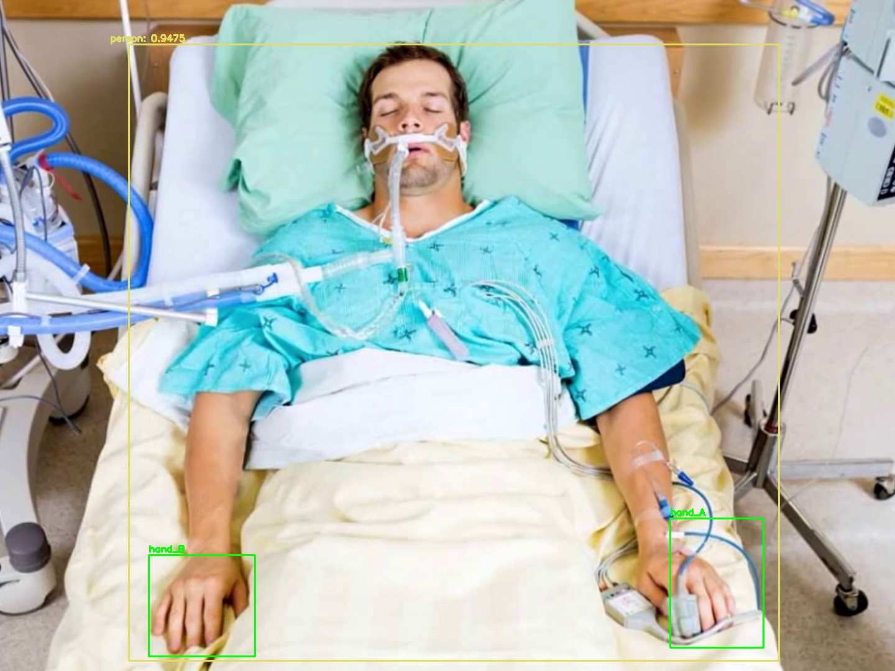

# AI_Activity_Monitoring
Deep Learning based Activity Monitoring System for ICU Patients

[](https://www.gnu.org/licenses/gpl-3.0)

### ✨ **Project Overview**

This project presents a three-stage deep learning pipeline for real-time activity recognition. The system first utilizes a YOLO (You Only Look Once) model to perform robust human localization within a video frame. Once a person is identified, a second model is employed to detect the position of their hands. The cropped hand region is then passed to a third stage custom-trained Keras classification model to determine the activity being performed (e.g., "Normal" or "Abnormal"). This approach allows for efficient and focused analysis, making it suitable for applications in safety monitoring, human-computer interaction, and automated surveillance.

---

### 📸 **System in Action**

*Human and Hand Detection:*


*Activity Classification Result:*


---

### 💻 **Tech Stack**

* **Language**: Python
* **Core Libraries**: OpenCV, TensorFlow, Keras, NumPy
* **Human Localization**: YOLO (You Only Look Once)
* **Development Environment**: Jupyter Notebooks, VS Code

---

### 🚀 **Features**

* **Stage 1: Human Localization**: Accurately detects and draws a bounding box around a person in the video feed using a pre-trained YOLO model.
* **Stage 2: Hand Detection**: Isolates the person and performs a secondary detection to find the precise location of their hands.
* **Stage 3: Activity Classification**: A custom Keras `Sequential` model classifies the activity based on the cropped image of the hand.
* **Real-Time Processing**: The pipeline is designed to process video streams frame by frame for real-time feedback.
* **Modular Codebase**: The project is structured with separate scripts for the model architecture, training, and inference for maintainability.

---

### ⚙️ **Installation & Setup**

1.  **Clone the repository:**
    ```bash
    git clone [https://github.com/nikitha-magi/AI_Activity_Monitoring.git](https://github.com/nikitha-magi/AI_Activity_Monitoring.git)
    cd AI_Activity_Monitoring
    ```

2.  **Create and activate a virtual environment:**
    ```bash
    python -m venv venv
    source venv/bin/activate  # On Windows use `venv\Scripts\activate`
    ```

3.  **Install dependencies from `requirements.txt`:**
    ```bash
    pip install -r requirements.txt
    ```
Note: all the weights are included in this repo

---
